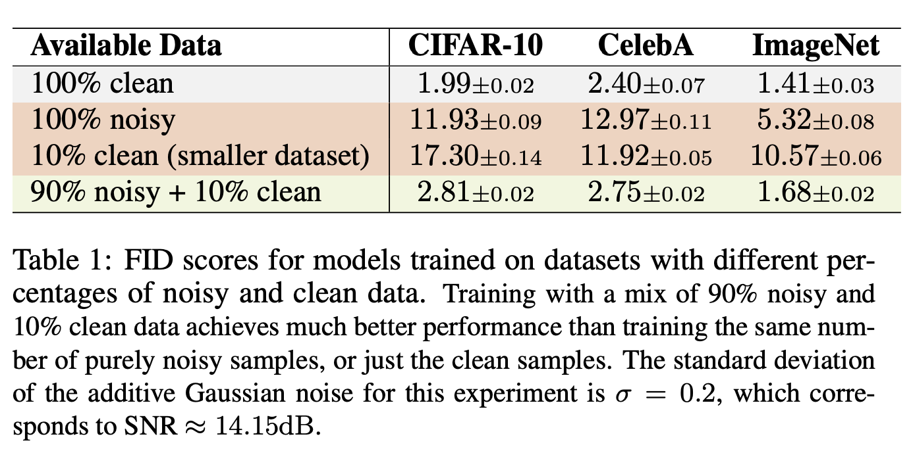

<div align="center">

# How much is a noisy image worth? 👀<br /> Data scaling laws for Ambient Diffusion

[](https://arxiv.org/abs/2411.02780) [](https://huggingface.co/giannisdaras?search_models=ambient_laws)

[Giannis Daras*](https://giannisdaras.github.io/), [Yeshwanth Cherapanamjeri†](https://yeshwanth94.github.io/), [Constantinos Daskalakis](https://people.csail.mit.edu/costis/)<br />
🏫 [MIT CSAIL](https://www.csail.mit.edu/), 🏫 [IFML](https://www.ifml.institute/index.php/)

*Equal contribution


</div>

```
The quality of generative models depends on the quality of the data they are trained on. Creating large-scale, high-quality datasets is often expensive and sometimes impossible, e.g. in certain scientific applications where there is no access to clean data due to physical or instrumentation constraints. Ambient Diffusion and related frameworks train diffusion models with solely corrupted data (which are usually cheaper to acquire) but ambient models significantly underperform models trained on clean data. We study this phenomenon at scale by training more than 80 models on data with different corruption levels across three datasets ranging from 30,000 to ≈1.3M samples. We show that it is impossible, at these sample sizes, to match the performance of models trained on clean data when only training on noisy data. Yet, a combination of a small set of clean data (e.g. 10% of the total dataset) and a large set of highly noisy data suffices to reach the performance of models trained solely on similar-size datasets of clean data, and in particular to achieve near state-of-the-art performance. We provide theoretical evidence for our findings by developing novel sample complexity bounds for learning from Gaussian Mixtures with heterogeneous variances. Our theoretical model suggests that, for large enough datasets, the effective marginal utility of a noisy sample is exponentially worse than that of a clean sample. Providing a small set of clean samples can significantly reduce the sample size requirements for noisy data, as we also observe in our experiments.
```

**TLDR**: We show that noisy images can be almost as useful as clean images for training generative models, assuming that a small initial set of clean images is available.

# ⚡️ Paper highlights 

Training on 100\% clean data gives the best performance. But what if we don't have access to that much clean data?


Training on a smaller set of clean data (10% of the total dataset) gives very poor performance. Training solely on noisy data gives also poor performance.

What we show is that training on a combination of a small set of clean data and a large set of noisy data gives comparable performance to training on 100\% clean data 🤯.

## Pricing of bad data 💰

We train more than **80 models** on different levels of corruption and amounts of clean and noisy data. These trainings help us understand the value of bad data. For example, we derive the following inequality for noisy images at SNR 14.15dB on ImageNet:

<div align="center">

  **Clean Data Price** ∈ [1.5, 1.75] x **Noisy Data Price**
</div>

This means that we need at most 1.75x as many noisy images as clean images to match the performance of training on 100\% clean data, as long as a small set of clean images is also available.


# ⚙️ Installation
The recommended way to run the code is with an Anaconda/Miniconda environment.
First, clone the repository: 

`git clone https://github.com/giannisdaras/ambient-laws.git`.

Then, create a new Anaconda environment and install the dependencies:

`conda env create -f environment.yml -n ambient-laws`

# 🤖 Pre-trained models

We provide Hugginface 🤗 checkpoints for all the models we trained in the paper. You can download them from [here](https://huggingface.co/giannisdaras?search_models=ambient_laws). 

The model parameters can be inferred by the model name. For example, [ambient_laws_celeba_sigma_0.05_corruption_0.1_keep_1.0](https://huggingface.co/giannisdaras/ambient_laws_celeba_sigma_0.05_corruption_0.1_keep_1.0) is a model trained on the whole CelebA dataset (keep=1.0) with 10\% of the dataset being corrupted (corruption=0.1) and the noise standard deviation being 0.05. 

To generate images from a pre-trained model, you can run:
```
python -m torch.distributed.run --standalone generate.py --seeds=0-49999 --network={checkpoint | huggingface name} --outdir={outdir} --batch={batch_size}
```
### 🧑‍🏫 Example

For example, you can run:
```bash
python -m torch.distributed.run --standalone generate.py \
    --seeds=0-49999 \
    --network=giannisdaras/ambient_laws_celeba_sigma_0.05_corruption_0.1_keep_1.0 \
    --outdir="outputs" \
    --batch=8
```
## 📊 Evaluate FID

To compute FID, you can run:
```python
python -m torch.distributed.run --standalone eval_fid.py \
    --gen_path={outdir} \
    --ref_stats={dataset_stats}
```
You can download the dataset statistics needed for FID computation from [here](https://nvlabs-fi-cdn.nvidia.com/edm/fid-refs/).


# 🥷 Train your own models with a mix of clean and noisy data 

To train your own models with a mix of clean and noisy data, you can run:

```bash
python -m torch.distributed.run --standalone train.py \
            --outdir={outdir} \
            --data={dataset_path} \
            --sigma={sigma} --corruption_probability={corruption_probability} --dataset_keep_percentage={dp} \
            --consistency_coeff={consistency_coeff} \
            --expr_id=cifar_cp{corruption_probability}_sigma{sigma}_dp{dp}_cc{consistency_coeff}"""
```

* The parameter {dp} controls how much of your dataset you use. By default, this is set to 1.0.
* The parameter {corruption_probability} controls what percentage of images should be corrupted. By default, this is set to 0.0.
* The parameter {sigma} controls how much noise there will be in the corrupted data in your dataset. Sigma=0.2 corresponds to 14.15dB SNR.
* The parameter {consistency_coeff} controls the weight of the consistency loss. By default, this is set to 0.0. **Attention**: When using this loss, the training will be slower. It is recommended to use this when corruption_probability is close to 1.0. For all other cases, we recommend setting this to 0.0. Even if consistency is used, it might be beneficial to train first without it and then only finetune with it. You can resume a training from a checkpoint by setting the --resume flag to the path of the checkpoint (`.pt`) file.

The codebase can be trivially extended to accomadate different noise level per point in the dataset. This is currently not supported, but you should be able to achieve this by appropriately changing the loss function (see [here](https://github.com/giannisdaras/ambient-laws/blob/main/training/loss.py)).


# 📄 Citation

If you find this work useful for your research, please consider citing our paper:

```
@article{ambient_laws,
  author    = {Giannis Daras and Yeshwanth Cherapanamjeri and Constantinos Daskalakis},
  title     = {How much is a noisy image worth? Data scaling laws for Ambient Diffusion.},
  journal   = {arXiv preprint arXiv:2411.02780},
  year      = {2024},
  url       = {https://arxiv.org/abs/2411.02780}
}
```

# 🔗 Related Codebases

* [EDM](https://github.com/NVlabs/edm): starting point for this repository.
* [Ambient Diffusion](https://github.com/giannisdaras/ambient-diffusion): trains models for linear corruptions.
* [Consistent Diffusion Meets Tweedie](https://github.com/giannisdaras/ambient-tweedie): trains models with only noisy data, with support for Stable Diffusion finetuning.
* [Consistent Diffusion Models](https://github.com/giannisdaras/cdm): original implementation of the consistency loss.


# 📧 Contact

If you are interested in colaborating, please reach out to gdaras[at]mit[dot]edu.


